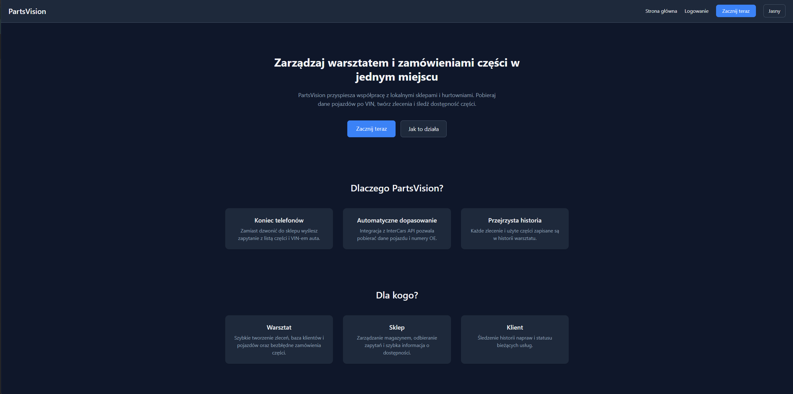
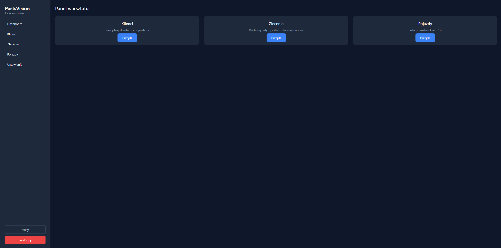
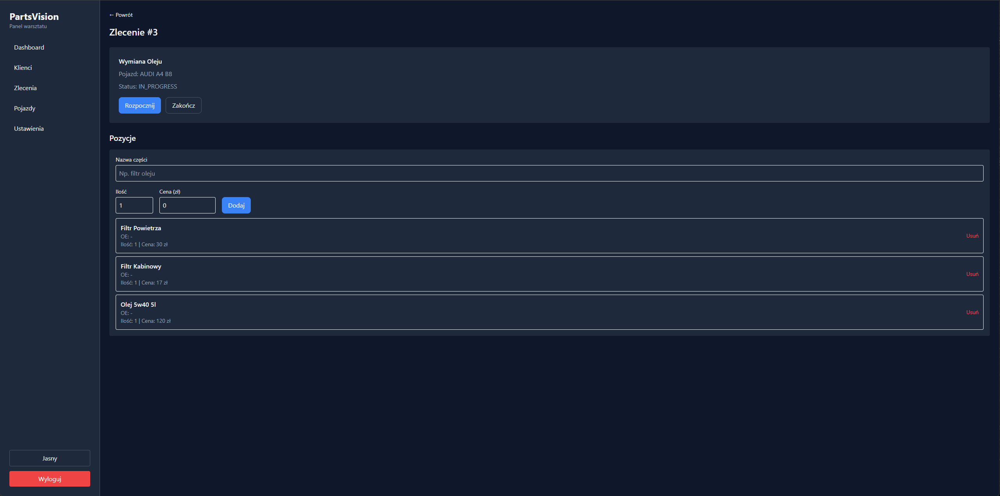
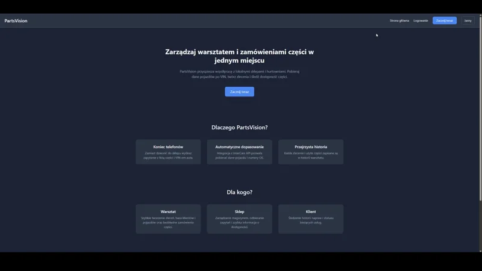

# PartsVision  

## Krótki opis
PartsVision to pełny system do zarządzania warsztatem samochodowym.  
Aplikacja zawiera **frontend (React + TypeScript + Vite)** oraz **backend (Node.js + Express + Prisma)**.  
Umożliwia obsługę klientów, pojazdów, zleceń oraz konfigurację warsztatu.  
Projekt jest w pełni responsywny, posiada tryb ciemny/jasny i autoryzację JWT.

---

## Screenshots  


---

---


---

## Video demo  


---

## Funkcjonalności

### Aplikacja (frontend)
- Strona główna z sekcjami i CTA
- Rejestracja, logowanie, walidacja formularzy
- Setup konta (wybór roli, utworzenie warsztatu)
- Dashboard warsztatu (Klienci / Pojazdy / Zlecenia)
- Dodawanie, edycja i usuwanie:
  - klientów
  - pojazdów
  - zleceń
  - pozycji zlecenia (części)
- Wyszukiwarka pojazdów z debouncingiem 300ms
- Protected Routes + obsługa ról użytkownika
- Theme (dark/light) z persystencją w localStorage
- Sidebar (desktop) oraz navbar mobilny

### Backend (API)
- JWT Authentication  
- Kontekst warsztatu (każdy użytkownik ma swój warsztat)
- Modele: User, Workshop, Client, Vehicle, Order, OrderItem
- Pełne CRUD dla wszystkich encji
- Walidacja i autoryzacja na poziomie middleware
- Prisma ORM + SQLite / Render PostgreSQL

---

## Uruchamianie FRONTEND

### 1. Sklonuj repozytorium:
```bash
git clone https://github.com/barteq370/partsvision.git
cd partsvision/frontend
```
### 2. Zainstaluj zależności:
```bash
npm install
```
### 3. Dodaj plik .env:
```bash
VITE_API_URL=http://localhost:4000
```

### 4. Uruchom projekt:
```bash
npm run dev
```
### 5. Aplikacja wystartuje pod adresem:

http://localhost:5173

### Build Produkcyjny (frontend)
```bash
npm run build
npm run preview
```

## Uruchamianie BACKEND
### 1.Przejdź do folderu backend:
```bash
cd backend
```
### 2. Instalacja zależności:

```bash
npm install
```
### 3. Plik .env:
```bash
DATABASE_URL="file:./dev.db"
JWT_SECRET="dodaj-tutaj-supersecret"
```
### 4. Migracje Prisma:

```bash
npx prisma migrate dev
```
### 5. Uruchom backend:

```bash
npm run dev
```

### 6. API startuje pod:
http://localhost:4000

## Struktura projektu

### Frontend (`/frontend`)

```
src/
├─ components/ # Komponenty wielokrotnego użytku
│ ├─ layout/ # Navbar, footer, layouty stron (RootLayout, WorkshopLayout)
│ ├─ ui/ # Małe komponenty UI (np. FeatureCard)
│ └─ ProtectedRoute.tsx # Ochrona tras na podstawie tokenu/roli
│
├─ pages/
│ ├─ auth/ # Logowanie, rejestracja
│ ├─ setup/ # Wybór roli, konfiguracja warsztatu
│ ├─ workshop/ # Dashboard, klienci, pojazdy, zlecenia
│ │ ├─ ClientCreate.tsx
│ │ ├─ ClientEdit.tsx
│ │ ├─ ClientList.tsx
│ │ ├─ ClientDetails.tsx
│ │ ├─ VehicleCreate.tsx
│ │ ├─ VehicleDetails.tsx
│ │ ├─ VehicleEdit.tsx
│ │ ├─ OrderCreate.tsx
│ │ ├─ OrderList.tsx
│ │ └─ OrderDetails.tsx
│ └─ Landing.tsx
│
├─ store/ # Globalny stan aplikacji
│ ├─ useAuthStore.ts # Token, dane użytkownika, logowanie, rejestracja
│ └─ useThemeStore.ts # Tryb ciemny/jasny z persystencją w localStorage
│
├─ utils/ # Walidacja, regexy
│ └─ validators.ts # Walidacja formularzy (email, VIN, telefon, itp.)
│
├─ config/
│ └─ api.ts # API_URL (z VITE_API_URL)
│
├─ layout/
│ ├─ RootLayout.tsx # Layout głównej strony (navbar + outlet)
│ └─ WorkshopLayout.tsx # Layout panelu warsztatu, sidebar + mobile menu
│
├─ main.tsx # Inicjalizacja aplikacji i React Routera
└─ index.css # Globalny CSS + zmienne kolorów dla motywów
```
---

### Backend (`/backend`)
```
src/
├─ controllers/ # Logika biznesowa
│ ├─ authController.ts # Logowanie, rejestracja, pobranie użytkownika
│ ├─ clientController.ts # CRUD klientów
│ ├─ vehicleController.ts # CRUD pojazdów + wyszukiwanie
│ ├─ orderController.ts # CRUD zleceń + pozycje w zleceniu
│ └─ workshopController.ts # Tworzenie warsztatu i przypisywanie roli
│
├─ middleware/
│ └─ authMiddleware.ts # Weryfikacja tokenu JWT i dodawanie danych użytkownika do req.user
│
├─ routes/ # Definicje tras API
│ ├─ auth.ts
│ ├─ clientRoutes.ts
│ ├─ vehicleRoutes.ts
│ ├─ orderRoutes.ts
│ └─ workshop.ts
│
├─ utils/
│ ├─ hash.ts # Hashowanie i porównywanie haseł (bcrypt)
│ └─ jwt.ts # Generowanie i weryfikacja tokenów JWT
│
├─ types/
│ └─ express.d.ts # Poszerzenie interfejsu Express.Request o "user"
│
└─ index.ts # Główna konfiguracja Express, rejestracja tras, middleware
```
---
## Kluczowe Komponenty
### 1. ProtectedRoute.tsx

Odpowiada za ochronę tras i przekierowywanie użytkownika w zależności od tokenu oraz roli.
```
<ProtectedRoute role="WORKSHOP">
    <WorkshopLayout />
</ProtectedRoute>
```

#### Działanie:
```
jeśli brak tokenu → /login
jeśli rola USER → /setup
jeśli rola niewłaściwa → /setup
```
### 2. useAuthStore (Zustand)

Centralne miejsce zarządzania autoryzacją.
```
const login = useAuthStore((s) => s.login);
const ok = await login(email, password);
```

Zawiera:
- token
- user
- login/register/logout
```
initialize() → wczytuje token po odświeżeniu
```

### 3. WorkshopLayout – Layout panelu warsztatu
- Najbardziej rozbudowany element projektu odpowiedzialny za dashboard warsztatu

### 4. validators.ts – Walidacja formularzy

Przykład:
```
validateEmail("abc@") // "Niepoprawny format email."
validateVIN("WBA3A...") // albo błąd
```


Stosowane w każdej stronie z formularzami (register, login, create/edit forms).

## Biblioteki (frontend)

### React Router v7  
- routing (public routes, protected routes).  
- Niezbędny, ponieważ aplikacja składa się z wielu ekranów panelu warsztatu.

### Zustand  
- biblioteka do zarządzania stanem globalnym.  

### TailwindCSS  
- UI oraz dark mode bez konieczności pisania osobnych arkuszy stylów.  

---

## Biblioteki (backend)

### Express  
- framework Node.js do tworzenia API.  

### Prisma  
- Nowoczesny ORM, który generuje typowany klient TypeScript.  

### jsonwebtoken  
- Służy do generowania i weryfikacji tokenów JWT.  
- Wybrany, bo umożliwia łatwą implementację autoryzacji użytkownika i kontrolę roli.

### bcryptjs  
- Używany do haszowania haseł.  

### SQLite (Render/Local) 
- Lekka baza danych, niewymagająca konfiguracji
---


## Co sprawiło trudność
### 1. Routing + role użytkowników

Gdy użytkownik rejestrował się po czym przypisywano mu role USER, ale panel wymagał roli WORKSHOP.
Powodowało to zapętlenia i redirecty na niewłaściwe ekrany.

#### Rozwiązanie:
- Stworzenie w ProtectedRoute logiki:
```
USER → zawsze redirect do /setup
WORKSHOP → pełny dostęp
```
- Jeszcze pare innych rzeczy ale nie pamiętam postaram się dodać to pozniej

---

### Future Improvements:
- Integracja z InterCars API (VIN → dane pojazdu + części) (niestety nie mam jeszcze dostępów)
- System dla roli sklep i klient
## Live Demo

### https://www.partsvision.pl/
